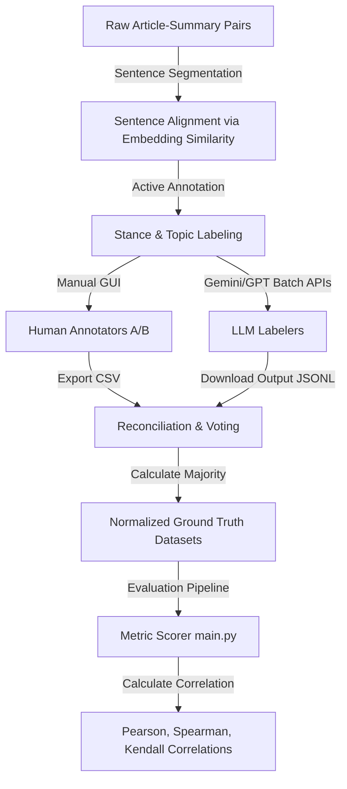
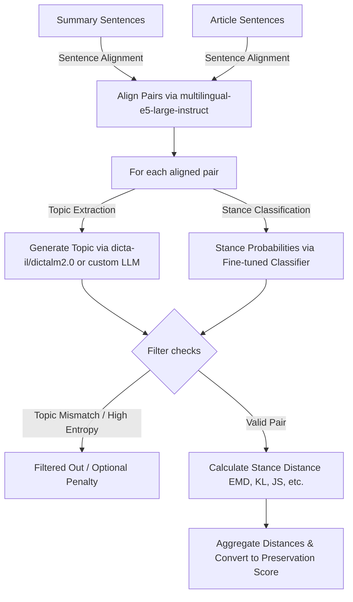

# Stance Preservation Evaluation (Hebrew & English)

Welcome to the **Stance Preservation Evaluation** repository. This research toolkit is designed to generate datasets, perform annotation (manual and automated), and evaluate benchmark metrics that quantify **stance preservation** between source articles and their summaries.

Stance preservation assesses whether a summary accurately reflects the author's stance (attitude: *Favor*, *Against*, or *Neutral*) towards specific topics discussed in the source text. This repository supports evaluation in both **Hebrew** and **English**, and features our core proposed metric based on **Earth Mover's Distance (EMD)** alongside standard baseline metrics.

---

## Table of Contents
1. [Pipeline & Architecture Overview](#pipeline--architecture-overview)
2. [Installation & Setup](#installation--setup)
3. [Data & Annotation Pipeline](#data--annotation-pipeline)
   - [CSV Schema](#csv-schema)
   - [Manual Annotation GUI](#manual-annotation-gui)
   - [Automated LLM Labeling (Batch APIs)](#automated-llm-labeling-batch-apis)
   - [Majority Voting & Reconciliation](#majority-voting--reconciliation)
4. [Stance Preservation Metric Scorers](#stance-preservation-metric-scorers)
   - [Lexical & Overlap Metrics](#lexical--overlap-metrics)
   - [Semantic Embedding Similarity](#semantic-embedding-similarity)
   - [Direct LLM Rating](#direct-llm-rating)
   - [Natural Language Inference (NLI) Stance-Shift](#natural-language-inference-nli-stance-shift)
   - [Earth Mover's Distance (EMD) Stance Scorer](#earth-movers-distance-emd-stance-scorer)
5. [Reproducing Results](#reproducing-results)
   - [Baseline Evaluation](#baseline-evaluation)
   - [EMD Distance Ablation Study](#emd-distance-ablation-study)
   - [Inter-Annotator Agreement Heatmaps](#inter-annotator-agreement-heatmaps)
   - [Confusion Matrices](#confusion-matrices)
   - [Provenance Analysis](#provenance-analysis)

---

## Pipeline & Architecture Overview

The following workflow demonstrates the data pipeline from raw text inputs to final stance preservation evaluation:



---

## Installation & Setup

### Requirements
- **Python**: `>=3.11`
- **Hardware**: GPU with CUDA support is highly recommended for running local topic and stance models (specifically `dicta-il/dictalm2.0` in 4-bit quantization).

### Dependency Setup
We recommend using [uv](https://github.com/astral-sh/uv) for fast, reproducible dependency management, but you can also use standard `venv` and `pip`.

#### Option A: Using `uv` (Recommended)
Sync dependencies and spawn the virtual environment:
```bash
uv sync
source .venv/bin/activate
```

#### Option B: Using `pip`
Create a virtual environment and install packages from [pyproject.toml](file:///home/eyalm/Desktop/university/research/stance-preservation/pyproject.toml):
```bash
python3 -m venv .venv
source .venv/bin/activate
pip install --upgrade pip
pip install .
```

### Environment Configuration
The API-driven scorers (Embedding, LLM, and LLM labeling scripts) require access keys. Create a `.env` file in the root directory:
```env
OPENAI_API_KEY=your_openai_api_key
OPENAI_ORG=your_openai_org_id (optional)
OPENAI_PROJECT=your_openai_project_id (optional)
GEMINI_API_KEY=your_gemini_api_key
```

---

## Data & Annotation Pipeline

The datasets reside in the [data/datasets/](file:///home/eyalm/Desktop/university/research/stance-preservation/data/datasets) directory.
- `english_data.csv` / `hebrew_data.csv`: Raw article-summary pairings.
- `english_data_labeled.csv` / `hebrew_data_labeled.csv`: Datasets containing individual human and LLM annotations.
- `english_normalized_majority.csv` / `hebrew_normalized_majority.csv`: Dataset with aggregated majority vote labels.

### CSV Schema
A fully labeled dataset containing annotations has the following schema:
- `article` / `summary`: The complete text of the article and summary.
- `sentence_in_summary`: The summary sentence being evaluated.
- `best_match_sentences_from_article`: The semantically closest sentence from the article.
- `match_score`: Cosine similarity score between the two aligned sentences.
- `{Annotator}_summary_topic` / `{Annotator}_summary_stance`: Topic and stance for the summary sentence.
- `{Annotator}_article_topic` / `{Annotator}_article_stance`: Topic and stance for the aligned article sentence.

*Annotator options: `annotator_A`, `annotator_B`, `GPT`, `Gemini`.*

### Manual Annotation GUI
Human annotators can perform manual labeling using a custom PyQt6 graphical interface:
```bash
python scripts/stance_annotator_gui.py
```
- **Load CSV**: Imports raw or partially labeled CSV files.
- **Process Flow**: Deduplicates sentences, presents them in context, and prompts the user to enter the topic (up to 3 words) and select a stance (*Favor*, *Against*, *Neutral*).
- **Save File**: Exports annotations directly back to the CSV.

### Automated LLM Labeling (Batch APIs)
To scale up labeling, we provide scripts that leverage the Gemini and GPT Batch APIs. They load prompts from [data/prompts/](file:///home/eyalm/Desktop/university/research/stance-preservation/data/prompts) and return structured JSON responses containing topics and stances.

#### Gemini Batch Labeling
Uses the new `google-genai` SDK and Gemini's Batch API to upload input, run batch inference, download, and parse responses:
```bash
python scripts/gemini_labeling.py \
  --csv-path data/datasets/hebrew_data.csv \
  --save-path data/datasets/hebrew_data_gemini_labeled.csv \
  --prompt-path data/prompts/he_labeling_prompt.txt \
  --model gemini-2.5-flash
```
*Note: If you need to resume polling an active batch, pass `--batch-id {JOB_ID}`. If you have downloaded the JSONL result locally, pass `--jsonl-path {PATH}` to skip request creation and parse results directly.*

#### GPT Batch Labeling
Uses the OpenAI Batch API:
```bash
python scripts/gpt_labeling.py \
  --csv-path data/datasets/hebrew_data.csv \
  --save-path data/datasets/hebrew_data_gpt_labeled.csv \
  --prompt-path data/prompts/he_labeling_prompt.txt \
  --model gpt-5-mini-2025-08-07
```

### Majority Voting & Reconciliation
Since different annotators (human and LLM) label topics and stances, we compute standard majority ground-truths using [scripts/calculate_majority.py](file:///home/eyalm/Desktop/university/research/stance-preservation/scripts/calculate_majority.py):
```bash
python scripts/calculate_majority.py \
  data/datasets/hebrew_data_labeled.csv \
  data/datasets/hebrew_normalized_majority.csv \
  --tie-break-prefix annotator_B
```

#### Algorithms Used:
1. **Stance Voting**: Resolves ties using the specified `--tie-break-prefix` (default: `annotator_B`). Standardizes all labels into `Favor`, `Against`, or `Neutral`.
2. **Topic Stemming & Clustering**:
   - **Hebrew**: Custom prefix (`ה`, `ב`, `ל`, etc.) and suffix (`יות`, `ים`, `ות`, etc.) stripping.
   - **English**: Snowball Stemmer.
   - **Clustering**: A Union-Find algorithm groups topics. Topics are matched if they have a character/token Jaccard similarity above thresholds (Jaccard: `0.4`, Fuzzy phrase similarity: `0.80`).
3. **Cross-Side Reconciliation**: If the majority summary topic and majority article topic are matched, they are aligned to the longer representative string to ensure exact lexical matches on both sides of the row.

---

## Stance Preservation Metric Scorers

The evaluation pipeline is orchestrated by [main.py](file:///home/eyalm/Desktop/university/research/stance-preservation/main.py) which loads a scorer class from [src/models/](file:///home/eyalm/Desktop/university/research/stance-preservation/src/models) and correlates its scores with ground truth labels.

### Lexical & Overlap Metrics
- **BLEU ([src/models/bleu.py](file:///home/eyalm/Desktop/university/research/stance-preservation/src/models/bleu.py))**: Computes sentence BLEU.
  - `--use-hebrew-morph-normalization`: Splits proclitics and removes niqqud to normalize Hebrew before scoring.
  - `--use-topic-filtering` / `--use-topic-mismatch-filtering`: Filters BLEU pairs to same-topic or different-topic alignments.
- **ROUGE ([src/models/rouge.py](file:///home/eyalm/Desktop/university/research/stance-preservation/src/models/rouge.py))**: Computes F-measures for ROUGE-1, ROUGE-2, and ROUGE-L.
- **TF-IDF ([src/models/tf_idf.py](file:///home/eyalm/Desktop/university/research/stance-preservation/src/models/tf_idf.py))**: Char n-gram (3-to-5) cosine similarity.

### Semantic Embedding Similarity
- **Embedding Scorer ([src/models/emb.py](file:///home/eyalm/Desktop/university/research/stance-preservation/src/models/emb.py))**: Generates OpenAI embeddings (default: `text-embedding-3-large`) for summary and article texts, computing their cosine similarity.

### Direct LLM Rating
- **LLM Scorer ([src/models/llm.py](file:///home/eyalm/Desktop/university/research/stance-preservation/src/models/llm.py))**: Prompts an LLM (default: `gpt-5-mini-2025-08-07`) using [data/prompts/prediction_prompt.txt](file:///home/eyalm/Desktop/university/research/stance-preservation/data/prompts/prediction_prompt.txt) to rate stance preservation directly on a scale of 0 to 10. The score is normalized to `[0.0, 1.0]`.

### Natural Language Inference (NLI) Stance-Shift
- **NLI Scorer ([src/models/nli.py](file:///home/eyalm/Desktop/university/research/stance-preservation/src/models/nli.py))**: Runs a zero-shot classification pipeline (default: `joeddav/xlm-roberta-large-xnli`) with dynamic templates (in English or Hebrew) to classify text into `Favor`, `Against`, or `Neutral` toward the topic. It calculates expected stance values:
  $$\text{Expected Stance} = P(\text{Favor}) - P(\text{Against})$$
  The score is computed either as the signed stance shift or absolute preservation:
  $$\text{Preservation Score} = 1 - \frac{|\text{Expected Stance}_{\text{summary}} - \text{Expected Stance}_{\text{article}}|}{2}$$

### Earth Mover's Distance (EMD) Stance Scorer
The EMD Scorer ([src/models/emd.py](file:///home/eyalm/Desktop/university/research/stance-preservation/src/models/emd.py)) is the primary contribution. It measures stance preservation at a distribution level:



1. **Sentence Alignment**: Summary and article sentences are aligned 1-to-1 using a semantic embedding model (`intfloat/multilingual-e5-large-instruct`).
2. **Topic Generation**: For each sentence, a topic is extracted using a local LLM (`dicta-il/dictalm2.0` in 4-bit Nf4 quantization) or provided by ground truth `--use-gold-emd-topics`.
3. **Stance Probability Classifier**: Sentences are mapped to three probabilities (`Against`, `Neutral`, `Favor`) using a fine-tuned sequence classification model (`models/stance_detection`).
4. **Filtering**:
   - **Topic Matching**: Filters out sentence pairs where generated topics do not match (either hard matching, or soft matching based on character/token Jaccard and SequenceMatcher fuzzy similarity).
   - **Entropy Threshold**: Skips pairs where stance classification is highly uncertain (entropy above `--entropy-threshold`).
5. **Distance Computations**: Calculates distance between the stance probability distributions using Earth Mover's Distance (`ot.emd2` from Python Optimal Transport), Kullback-Leibler (KL), Jensen-Shannon (JS), Euclidean, Itakura-Saito, or Argmax ordinal/exact matches. EMD uses a cost matrix representing ordinal distances:
   $$C = \begin{pmatrix} 0 & 1 & 2 \\\\ 1 & 0 & 1 \\\\ 2 & 1 & 0 \end{pmatrix}$$

   Or represented as a cost table:
   | Stance | Against | Neutral | Favor |
   |---|---|---|---|
   | **Against** | 0 | 1 | 2 |
   | **Neutral** | 1 | 0 | 1 |
   | **Favor** | 2 | 1 | 0 |
6. **Divergence Penalty**: Skipped or filtered pairs can be penalized with maximum stance divergence using `--penalize-filtered-emd`.

---

## Reproducing Results

We evaluate metrics by calculating their Pearson ($r$), Spearman ($\rho$), and Kendall ($\tau$) correlation coefficients against the gold stance preservation scores.

### Baseline Evaluation
You can evaluate a single baseline using `main.py`:
```bash
python main.py \
  --input-file data/datasets/hebrew_normalized_majority.csv \
  --language he \
  --aggregate-level article \
  --model bleu \
  --label-prefix majority
```

#### Run All Baselines
To run all baseline evaluations (BLEU, ROUGE-1/2/L, TF-IDF, embeddings, LLM, NLI) across both levels (sentence, article) and languages (en, he) in batch, run:
```bash
bash scripts/run_all_baselines.sh
```
This script writes summary outputs to [results/all_baselines_article.txt](file:///home/eyalm/Desktop/university/research/stance-preservation/results/all_baselines_article.txt) and [results/all_baselines_sentence.txt](file:///home/eyalm/Desktop/university/research/stance-preservation/results/all_baselines_sentence.txt).

### EMD Distance Ablation Study
To run the EMD pipeline, specify `--model emd`. You must have a GPU environment config to load the topic and stance classification models.

#### 1. Soft Topic Filtering + EMD
```bash
python main.py \
  --input-file data/datasets/hebrew_normalized_majority.csv \
  --language he \
  --aggregate-level article \
  --model emd \
  --emd-score-method emd \
  --use-soft-topic-filtering \
  --label-prefix majority
```

#### 2. Hard Topic Filtering + EMD
```bash
python main.py \
  --input-file data/datasets/hebrew_normalized_majority.csv \
  --language he \
  --aggregate-level article \
  --model emd \
  --emd-score-method emd \
  --use-topic-filtering \
  --label-prefix majority
```

#### 3. No Topic Filtering + EMD
```bash
python main.py \
  --input-file data/datasets/hebrew_normalized_majority.csv \
  --language he \
  --aggregate-level article \
  --model emd \
  --emd-score-method emd \
  --label-prefix majority
```

#### 4. Alternative Distance Metrics (e.g. KL, JS)
```bash
python main.py \
  --input-file data/datasets/hebrew_normalized_majority.csv \
  --language he \
  --aggregate-level article \
  --model emd \
  --emd-score-method kl \
  --label-prefix majority
```
*(Similarly replace `--emd-score-method` with `js`, `argmax_ordinal`, `argmax_exact`, `euclidean`, or `itakura` to replicate results in [results/dist_ablation.txt](file:///home/eyalm/Desktop/university/research/stance-preservation/results/dist_ablation.txt).)*

### Inter-Annotator Agreement Heatmaps
Generate a 2x2 grid plot of Cohen's Kappa agreements between all annotators (human and LLM) and write it to `figures/`:
```bash
# To generate Hebrew heatmap
python scripts/generate_agreement_heatmap.py \
  --input-csv data/datasets/hebrew_data_labeled.csv \
  --output-png figures/hebrew_heatmap_normalized.png

# To generate human-only agreement
python scripts/generate_agreement_heatmap.py \
  --input-csv data/datasets/hebrew_data_labeled.csv \
  --output-png figures/hebrew_heatmap_human.png \
  --annotators annotator_A,annotator_B
```

### Confusion Matrices
To construct a confusion matrix showcasing topic match/mismatch versus stance match/mismatch rates, run:
```bash
python scripts/calculate_confusion_matrix.py data/datasets/hebrew_normalized_majority.csv
```

### Provenance Analysis
To perform detailed provenance audits and compute Krippendorff's alpha (nominal) for inter-annotator reliability, run:
```bash
python scripts/analyze_majority_provenance.py \
  data/datasets/hebrew_normalized_majority.csv \
  --side article \
  --tie-break-prefix annotator_B
```
This reports the distribution of majority votes (e.g. supported by humans only, LLMs only, mixed support, or tie-break resolved) and checks final stance agreements.